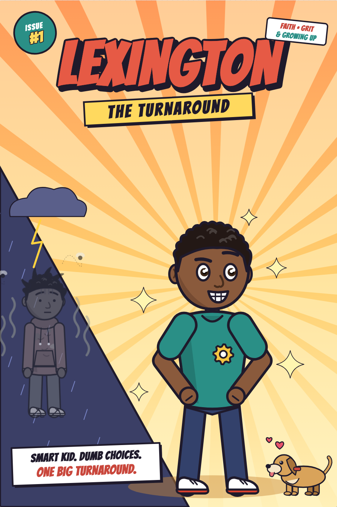
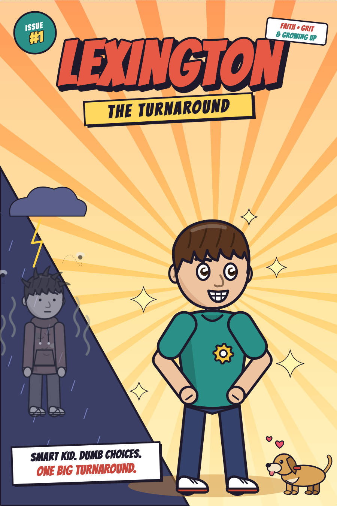
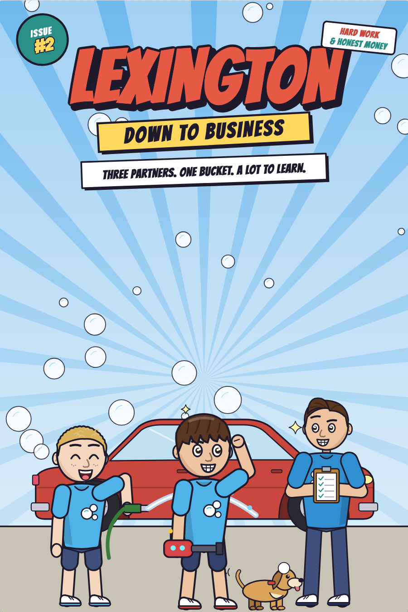

# Lexington: The Turnaround

An illustrated comic book about Lexington, a brilliant 13-year-old who keeps making bad choices. He forgets to shower, ignores his parents, and stays in trouble. Through prayer, determination and a lot of daily practice, he turns his life around.

| Original edition | Caucasian family edition |
|---|---|
|  |  |

## Issue #2: Down to Business



Lexington, his best friend Jonathan (from their ward) and Big Tony start the **Suds Brothers** car wash and learn the value of money and hard work: borrowing from Dad and paying him back, budgeting, marketing (never at church or on Sunday), honesty when they find cash in a customer's truck, redoing rushed work, tithing and fast offerings, service for the missionaries, and working out a fight between partners. The family is shown as members of The Church of Jesus Christ of Latter-day Saints, with Family Home Evening, passing the sacrament, the bishop, and scripture from the Bible and the Book of Mormon. It ends with "The Money Rules" and a "Start Your Own Business" worksheet.

| | |
|---|---|
| Web page | `issue-2.html` |
| PDF (21 pages) | `Lexington-Issue-2-Down-to-Business.pdf` |
| Single file | `Lexington-Issue-2-Down-to-Business.html` |
| Script | `js/issue2-world.js` (new cast, props, places), `js/issue2-story-1.js`, `js/issue2-story-2.js` |

Issue #2 uses the Caucasian family look and loads `js/kit.js` instead of Issue #1's story files.

KDP descriptions for the series and each issue are in `KDP-DESCRIPTIONS.md`.

## KDP paperback covers

Wraparound covers (back + spine + front) for a **6.75 × 10.25 in** paperback are in `kdp/`:

| Book | Cover PDF (upload to KDP) | Full size | Spine |
|---|---|---|---|
| Issue #1, original | `kdp/Lexington-The-Turnaround-KDP-Cover.pdf` | 13.8110 × 10.5 in | 0.0610 in (26 pages) |
| Issue #1, Caucasian family | `kdp/Lexington-The-Turnaround-Caucasian-KDP-Cover.pdf` | 13.8157 × 10.5 in | 0.0657 in (28 pages) |
| Issue #2 | `kdp/Lexington-Issue-2-Down-to-Business-KDP-Cover.pdf` | 13.8063 × 10.5 in | 0.0563 in (24 pages) |

- 0.125 in bleed on every outside edge. Text stays at least 0.25 in inside the trim.
- Spine width uses KDP's **premium color** rate (0.002347 in per page). Color books under 72 pages must use premium color, and books under 80 pages can't have spine text, so the spine is plain artwork.
- The back cover leaves KDP's 2 × 1.2 in barcode area empty (lower right). Choose "KDP will add the barcode" when uploading.
- Each book also has a 300 DPI PNG and a `-guides.png` preview showing trim (red), safe zone (blue), spine (green) and the barcode area.
- The spine depends on the interior page count. If your interior PDF ends up with a different count, rebuild: `node tools/kdp-covers.cjs --book=issue2 --pages=24` (needs Playwright, plus `pypdf` to set the exact page size).

The cover layout lives in `kdp-cover.html` and `js/kdp-cover.js`.

## Issue #1 editions

| | Original | Caucasian family edition |
|---|---|---|
| Family | Brown skin, black curly hair | Light skin, brown straight and wavy hair |
| Big Tony | Not in this edition | Lexington's 18-year-old brother, a high school senior |
| Pages | 26 | 28 (adds Big Tony's advice page and his graduation day) |
| Web page | `index.html` | `caucasian.html` |
| PDF | `Lexington-The-Turnaround.pdf` | `Lexington-The-Turnaround-Caucasian.pdf` |
| Single file | `Lexington-The-Turnaround.html` | `Lexington-The-Turnaround-Caucasian.html` |

Both editions share the same artwork code. The Caucasian edition turns on with `window.COMIC_EDITION = "caucasian"`, which `caucasian.html` sets before the scripts load. Every Big Tony scene in `js/story-*.js` sits behind a `CAU` check, so the original edition draws exactly as before.

## Read it

- **On the web:** open `index.html` (original) or `caucasian.html` in a browser. Choose **Full pages** to read like a printed comic, or **Panel by panel** for phones (phones start in this mode).
- **Print or share:** each PDF has one comic page per sheet at 7 × 10.5 in.
- **Email or offline:** each single-file `.html` is the whole comic in one file.

The lettering fonts load from Google Fonts. Without an internet connection the comic still works, with system fonts.

## The story

| Chapter | Pages | What happens |
|---|---|---|
| Cover, Meet the Cast | 1–2 | Lexington, Mom, Dad and Biscuit the dog, with "before" stats |
| 1. Big Brain, Bad Choices | 3–5 | A genius who builds robots but won't shower, brush, or handle the bathroom |
| 2. Set Up for Success | 6–7 | Mom and Dad build a chore chart and a Fresh Start Kit. He does the opposite |
| 3. Trouble, Trouble, Trouble | 8–9 | Constant yelling, whoopings, and Lexington hearing his parents pray for him |
| 4. The Turning Point | 10–11 | He finds his Bible, reads Ephesians 6:1, Philippians 4:13 and Luke 2, and prays on his own |
| 5. Day by Day | 12–14 | New routines, his own bathroom checklist, chores without reminders, a slip, and getting back up |
| 6. Things Get Easier | 15 | Better grades, no yelling, family game night |
| 7. A Faith of His Own | 16–17 | Praying and studying scripture on his own, leading grace, serving at church |
| 8. Lexington Enterprises | 18–19 | Sneaker cleaning and bike repair become a business. Give, save, spend |
| 9. Goals & Dreams | 20 | A goal board, learning to code, and buying his own laptop |
| 10. Standing Tall | 21–22 | Confidence at a youth business expo, then cooking, laundry and banking on his own |
| 11. The Last Time | 23–24 | He can't remember the last time he got in trouble, or why he'd want to |
| Then & Now, Daily Checklist | 25–26 | Before/after stats, his verses, and a printable weekly routine chart |

The Caucasian family edition also introduces **Big Tony** on the cast page and at breakfast, then gives him his own page after Lexington's prayer (big-brother advice about routines and getting back up), and a graduation day page before chapter 11. He also joins game night, dinner, church, the sneaker line with his prom shoes, the business expo and the finale.

Scripture is quoted from the King James Version.

## Change Lexington's look

Use **Lexington's look** in the reader toolbar to change the family's skin tone and hair color. Every page redraws, and the choice is remembered in that browser. You can also link straight to a look, for example `index.html?skin=tan&hair=brown`. Each edition remembers its own choice.

Skin options: `deep`, `brown`, `tan`, `light`, `fair`. Hair options: `black`, `brown`, `auburn`, `blond`.

## Files

| File | Purpose |
|---|---|
| `index.html`, `styles.css` | The reader page |
| `js/core.js` | Colors, drawing helpers and comic lettering (balloons, captions, sound effects) |
| `js/characters.js` | The posable character rig: poses, 40 facial expressions, hair, outfits, and the cast |
| `js/props.js` | Props and effects: furniture, the Bible, toothbrush, sneakers, bikes, Biscuit, stink lines, sparkles |
| `js/scenes.js` | Backgrounds: bedroom, bathroom, kitchen, church, school, garage, yard and more |
| `js/reader.js` | Page layout, the two reading modes, and the toolbar |
| `js/story-1.js` to `js/story-3.js` | The script: every page, panel, line of dialogue and caption |
| `caucasian.html` | The reader page for the Caucasian family edition |
| `tools/build.cjs` | Rebuilds the PDF, the single-file HTML and the cover image for one edition |

All artwork is drawn in code as SVG, so it stays sharp at any size.

## Edit the story

Each page in `js/story-*.js` lists its panel layout (`rows`) and its panels. A panel has an `art(w, h)` function that draws the scene and a `b(w, h)` list of balloons, for example:

```js
say("Up and at 'em!", x, y, top("teen", lexX, lexY, scale))
```

After editing, refresh `index.html` to see the change. To rebuild the PDF and single-file version:

```bash
cd lexington-comic
npm install playwright
npx playwright install chromium
node tools/build.cjs                      # original edition
node tools/build.cjs --edition=caucasian  # Caucasian family edition
node tools/build.cjs --edition=issue2     # Issue #2: Down to Business
node tools/build.cjs --skin=tan --hair=brown
```
